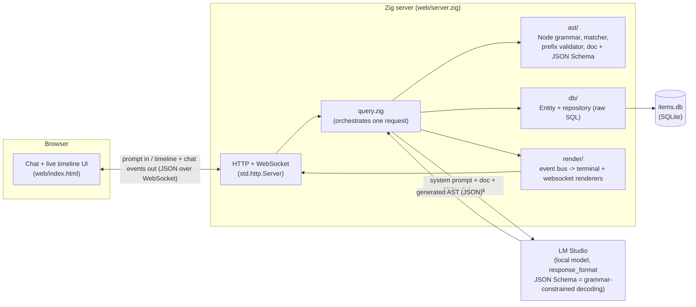

# Directed Decoding Demo

A small Zig project that lets you ask a natural-language question about a
SQLite-backed list of items, turns that question into a structured query
(an "AST") using a local LLM, validates the LLM's output byte-by-byte as it
streams in, and runs the resulting query against the database — with a
web UI that visualizes the whole pipeline in real time.

It's a testbed for **directed/guided decoding**: constraining an LLM's
output to a specific grammar, both via real constrained decoding
(`response_format` / JSON Schema, which LM Studio enforces during
generation) and via post-hoc validation with a retry-and-explain-the-error
loop for when that isn't enough on its own.

## Requirements

- [Zig](https://ziglang.org/) 0.16.0
- [LM Studio](https://lmstudio.ai/) running locally with a model loaded
  - Start its local server: `lms server start` (or via the LM Studio app)
  - Default expected address: `http://127.0.0.1:1234`
  - The model should support structured output / JSON Schema constraints
    for best results (LM Studio's own docs note this is unreliable on
    models under ~7B parameters — smaller models still mostly work here
    thanks to the retry loop, just less reliably on the first attempt)

## Running it

```sh
cd zig
zig build run
```

This opens (or creates) `items.db` in the current directory, seeds two demo
rows the first time it's empty, and starts a web server:

```
web ui listening at http://127.0.0.1:8080/
```

Open that URL in a browser.

## Using it

Type a question into the chat box, e.g.:

> give me all items that have name gadget and price 50

The right-hand panel ("How It Works") shows the request happening live:
- an animated diagram of the three participants (your browser, the Zig
  server, LM Studio) with packets traveling between them as the request
  is made
- a "brick wall" that builds up character by character as the LLM's raw
  response is fed through the validator, turning green (and pretty-printed)
  once it's confirmed valid, or red if rejected
- if the model's first attempt is rejected, you'll see a new "Attempt N"
  section appear as the server sends the rejection reason back to the model
  and asks it to try again (up to 3 attempts)

The chat panel then shows the actual matching items (or an explanation if
none matched, or if all attempts failed).

You can add more items directly against the database while the server is
running — no restart needed, each question re-reads the table fresh:

```sh
sqlite3 items.db "INSERT INTO items(name, price) VALUES ('widget-pro', 25);"
```

## Running the tests

```sh
cd zig
zig build test
```

## Architecture



### Modules

| Path | Responsibility |
|---|---|
| `main.zig` | Opens the db, seeds it, starts the web server |
| `query.zig` | One end-to-end request: prompt -> LLM -> validate -> parse -> match -> report, with the retry-with-feedback loop |
| `db/entity/item.zig` | `Item` value object (name, price) |
| `db/repository/item_crud_service.zig` | Raw-SQL CRUD against the `items` table (no ORM) |
| `db/connection.zig` | Opens the SQLite connection |
| `ast/entity/` | `Node`/`Ast` types: the query grammar (operand/action/path/value/then) |
| `ast/matcher.zig` | Resolves JSONPath-lite expressions and evaluates an `Ast` against JSON data; also `filterIndices` for "which items matched" |
| `ast/schema.zig` | Machine-readable description of the `Node` shape, used by the prefix validator |
| `ast/json_schema.zig` | Standard JSON Schema version of the same shape, sent to the LLM as `response_format` |
| `ast/doc.zig` | Plain-English description of the grammar, sent as the system prompt |
| `llm/client.zig` | HTTP client for LM Studio's OpenAI-compatible `/v1/chat/completions` |
| `llm/prefix_validator.zig` | Incremental JSON-syntax + schema validator built on `std.json.Scanner`, used to check the LLM's output as it "streams" (replayed byte-by-byte) |
| `render/` | `Event`/`Bus`/`Renderer` - a pluggable event bus; `TerminalRenderer` prints to stdout, `WebsocketRenderer` forwards to the browser |
| `web/server.zig` | The HTTP/WebSocket server: serves the page, runs one chat session per connection |
| `web/index.html` | The single-page UI: chat pane + the animated diagram/brick-wall pane |

## License

MIT - see [LICENSE](LICENSE).
